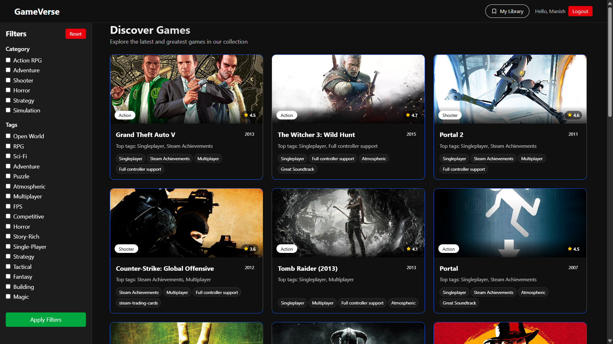
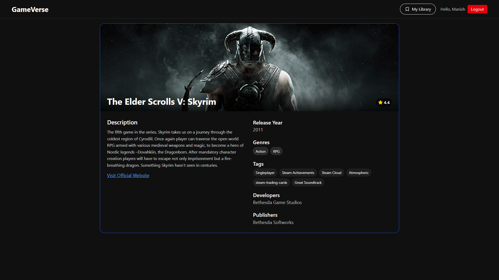

# 🎮 Gameverse

Gameverse is a React-based game discovery web app that allows users to explore games by category using the RAWG API. It also features user authentication via Clerk and plans to include a personal game library.

## 🚀 Features

- 🔍 Game discovery via RAWG API
- 📂 Category-based filtering
- ✅ Clerk authentication (working)
- 🔁 Infinite scroll for smoother game browsing
- ❤️ Add to library feature (in progress)

## ⚠️ Current Status

- ✅ **Clerk Authentication**: Working as expected
- ✅ **RAWG API Integration**: Successfully fetching game data
- ❌ **Filters**: Not working (UI present but not functional)
- ❌ **Library**: Not working (saving to personal library is not implemented yet)

## 🛠 Tech Stack

- React
- Redux
- Clerk (Auth)
- RAWG API
- Tailwind CSS

## 📌 To Do

- [ ] Fix filtering functionality
- [ ] Implement library feature for saving favorite games
- [ ] Improve UI/UX
- [ ] Add loading states and error handling

## 📸 Screenshots

## 🧑‍💻 Author

Created with ❤️ by Manish

---

